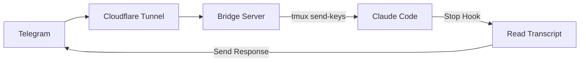

# claudecode-telegram


Telegram bot bridge for Claude Code. Send messages from Telegram, get responses back.

## How it works



1. Bridge receives Telegram webhooks, injects messages into Claude Code via tmux
2. Claude Code's Stop hook reads the transcript and sends response back to Telegram
3. Only responds to Telegram-initiated messages (uses pending file as flag)

## Install

```bash
# Prerequisites
brew install tmux cloudflared

# Clone
git clone https://github.com/hanxiao/claudecode-telegram
cd claudecode-telegram

# Setup Python env
uv venv && source .venv/bin/activate
uv pip install -e .
```

## Setup

### 1. Create Telegram bot

Bot receives your messages and sends Claude's responses back.

```bash
# Message @BotFather on Telegram, create bot, get token
```

### 2. Configure Stop hook

Hook triggers when Claude finishes responding, reads transcript, sends to Telegram.

```bash
cp hooks/send-to-telegram.sh ~/.claude/hooks/
nano ~/.claude/hooks/send-to-telegram.sh  # set your bot token
chmod +x ~/.claude/hooks/send-to-telegram.sh
```

Add to `~/.claude/settings.json`:

```json
{
  "hooks": {
    "Stop": [
      {
        "hooks": [
          {
            "type": "command",
            "command": "~/.claude/hooks/send-to-telegram.sh"
          }
        ]
      }
    ]
  }
}
```

### 3. Start tmux + Claude

tmux keeps Claude Code running persistently; bridge injects messages via `send-keys`.

```bash
tmux new -s claude
claude --dangerously-skip-permissions
```

### 4. Run bridge

Bridge receives Telegram webhooks and injects messages into Claude Code.

```bash
export TELEGRAM_BOT_TOKEN="your_token"
python bridge.py
# Note the webhook path shown in output (e.g., /<64-char-random-string>)
```

### 5. Expose via Cloudflare Tunnel

Tunnel exposes local bridge to the internet so Telegram can reach it.

```bash
cloudflared tunnel --url http://localhost:8080
```

### 6. (Optional but Recommended) Set webhook secret token

Generate a secure secret token to validate requests are from Telegram:

```bash
# Generate a secure random token
python3 -c "import secrets; print(secrets.token_urlsafe(32))"
```

Set the `TELEGRAM_WEBHOOK_SECRET` environment variable with the generated token:

```bash
export TELEGRAM_WEBHOOK_SECRET="<generated_token>"
```

### 7. Set webhook

Tells Telegram where to send message updates. Use the built-in CLI command (recommended):

```bash
# Set webhook with default domain (from WEBHOOK_DOMAIN env var, or coder.luandro.com)
claudecode-telegram set-webhook

# Set webhook with custom domain
claudecode-telegram set-webhook --domain your-domain.com

# Verify webhook is set correctly
claudecode-telegram get-webhook-info

# Delete webhook when needed
claudecode-telegram delete-webhook
```

The `set-webhook` command automatically:

- Uses the current `WEBHOOK_PATH` from your environment
- Includes `TELEGRAM_WEBHOOK_SECRET` if configured
- Validates the Telegram API response
- Reports success or failure with clear messages

**Manual webhook setup (alternative):**

```bash
# Replace <WEBHOOK_PATH> with the path shown in bridge output (e.g., /abc123...)
# Replace <SECRET_TOKEN> with your TELEGRAM_WEBHOOK_SECRET if configured
curl "https://api.telegram.org/bot${TELEGRAM_BOT_TOKEN}/setWebhook?url=https://YOUR-TUNNEL-URL.trycloudflare.com/<WEBHOOK_PATH>&secret_token=<SECRET_TOKEN>"
```

## Bot Commands

| Command          | Description                              |
| ---------------- | ---------------------------------------- |
| `/status`        | Check tmux session                       |
| `/clear`         | Clear conversation                       |
| `/resume`        | Pick session to resume (inline keyboard) |
| `/continue_`     | Auto-continue most recent                |
| `/loop <prompt>` | Start Ralph Loop (5 iterations)          |
| `/stop`          | Interrupt Claude                         |

## Token Protection

The project includes a pre-commit hook to prevent accidental token commits. To install:

```bash
# Install the pre-commit hook
make install-hooks

# Or manually
cp githooks/pre-commit .git/hooks/pre-commit
chmod +x .git/hooks/pre-commit
```

The hook scans staged files for:

- Telegram bot tokens (e.g., `bot123456789:ABC...`)
- Webhook secrets (Base64-like strings 40+ chars)
- Hardcoded tokens in code

**Important**: Never commit tokens. Use environment variables via `.env` file (already in `.gitignore`).

## Environment Variables

| Variable                    | Default             | Description                                                                    |
| --------------------------- | ------------------- | ------------------------------------------------------------------------------ |
| `TELEGRAM_BOT_TOKEN`        | required            | Bot token from @BotFather on Telegram                                          |
| `TELEGRAM_WEBHOOK_SECRET`   | empty               | Secret token to validate webhook requests from Telegram (strongly recommended) |
| `WEBHOOK_DOMAIN`            | `coder.luandro.com` | Default domain for set-webhook command                                         |
| `WEBHOOK_PATH`              | auto-generated      | Random webhook path (64-char hex string) for security                          |
| `ALLOWED_TELEGRAM_USER_IDS` | empty               | Comma-separated list of allowed Telegram user IDs for groups/channels          |
| `DM_ALLOWED_USER_ID`        | empty               | Single user ID allowed to send DM updates (private messages)                   |
| `TMUX_SESSION`              | `claude`            | tmux session name                                                              |
| `PORT`                      | `8080`              | Bridge port                                                                    |
| `HOST`                      | `127.0.0.1`         | Bridge host (defaults to localhost-only for security)                          |
| `TELEGRAM_REACTION_EMOJI`   | 👍                  | Emoji to react to messages (set to "none", "false", "0", or empty to disable)  |
| `CADDY_HTTP_PORT`           | `8081`              | External HTTP port for Caddy (must be >= 1024 for rootless Docker)             |
| `CADDY_HTTPS_PORT`          | `8443`              | External HTTPS port for Caddy (must be >= 1024 for rootless Docker)            |

### Access Control

The bot supports two types of access control:

1. **DM (Private Message) Control**: `DM_ALLOWED_USER_ID`
   - Only the specified user ID can interact via private messages
   - Get your user ID from [@userinfobot](https://t.me/userinfobot) on Telegram
   - If empty or not set, DM updates are not allowed from anyone

2. **Group/Channel Control**: `ALLOWED_TELEGRAM_USER_IDS`
   - Comma-separated list of user IDs allowed to use the bot in groups/channels
   - Example: `123456789,987654321`
   - If empty, all users can use the bot in groups/channels (not recommended for production)

### Quick Setup with .env

```bash
# Copy the example environment file
cp .env.example .env

# Edit with your values
nano .env  # Add your TELEGRAM_BOT_TOKEN and optionally TELEGRAM_WEBHOOK_SECRET

# Source the file before running the bridge
source .env
python bridge.py
```

## Docker Compose Setup

For production deployments, use Docker Compose with Caddy reverse proxy and HTTPS.

### Prerequisites

```bash
# Install Docker and Docker Compose
# On Ubuntu/Debian:
curl -fsSL https://get.docker.com -o get-docker.sh
sudo sh get-docker.sh
sudo usermod -aG docker $USER

# Install Docker Compose (if not included)
sudo apt-get install docker-compose-plugin
```

**Note for rootless Docker:** If you're running Docker in rootless mode (common in many setups), you cannot bind to privileged ports below 1024. This project uses port 8081 for HTTP and 8443 for HTTPS by default. You can customize these by setting `CADDY_HTTP_PORT` and `CADDY_HTTPS_PORT` in your `.env` file. For rootful Docker, you can set these to 80 and 443 respectively.

### Configuration

1. **Configure environment variables:**

```bash
cp .env.example .env
nano .env
```

Required variables in `.env`:

- `TELEGRAM_BOT_TOKEN`: Bot token from @BotFather
- `TELEGRAM_WEBHOOK_SECRET`: (Optional but recommended) Secret token for webhook validation

2. **Configure Caddy reverse proxy:**

Edit `Caddyfile` and replace `coder.luandro.com` with your domain:

```caddyfile
your-domain.com {
    reverse_proxy bridge:8080
    # ... rest of configuration
}
```

3. **Update tmux socket path (if needed):**

The `docker-compose.yml` uses `/tmp/tmux-1000/default` by default. If your tmux socket is elsewhere, check with:

```bash
tmux display-message -p "#{socket_path}"
```

Then update `TMUX_SOCKET` in your `.env` file.

### Starting the services

```bash
# Build and start all services
docker compose up -d

# View logs
docker compose logs -f

# Check service status
docker compose ps
```

### Setting the webhook

After starting the services, set the Telegram webhook:

```bash
# Using the CLI command (recommended)
docker compose exec bridge claudecode-telegram set-webhook --domain your-domain.com

# Or manually with curl
docker compose exec bridge curl "https://api.telegram.org/bot${TELEGRAM_BOT_TOKEN}/setWebhook?url=https://your-domain.com/${TELEGRAM_WEBHOOK_PATH}&secret_token=${TELEGRAM_WEBHOOK_SECRET}"
```

### Service management

```bash
# Stop services
docker compose down

# Restart services
docker compose restart

# Rebuild after code changes
docker compose up -d --build

# View logs for specific service
docker compose logs -f bridge
docker compose logs -f caddy
```

### Architecture

The Docker Compose setup includes:

1. **bridge**: Python application that receives Telegram webhooks and communicates with Claude Code via tmux
2. **caddy**: Reverse proxy providing HTTPS termination, security headers, and automatic SSL certificates via Let's Encrypt

Both services run on an internal Docker network (`claude-telegram-net`) for isolation.

## Testing

The project includes tests for HTTPS connectivity and deployment verification.

### Install test dependencies

```bash
# Install pytest and test dependencies
uv pip install -e ".[test]"
```

### Run tests

**Local tests** (Caddyfile config, local port checks):

```bash
# Run local tests only (no network calls)
pytest tests/test_https_connectivity.py
```

**Deployment verification** (DNS, SSL, HTTPS connectivity):

```bash
# Run all tests including network-dependent checks
RUN_DEPLOYMENT_CHECKS=1 pytest tests/test_https_connectivity.py -m integration

# Test against a custom domain
DEPLOYMENT_DOMAIN=your-domain.com RUN_DEPLOYMENT_CHECKS=1 pytest tests/test_https_connectivity.py -m integration
```

**Standalone execution**:

```bash
# Run as standalone script (shows detailed output)
python tests/test_https_connectivity.py

# With deployment checks enabled
RUN_DEPLOYMENT_CHECKS=1 python tests/test_https_connectivity.py
```

### Test environment variables

Test-specific variables used by `pytest tests/test_https_connectivity.py`:

| Variable                | Default             | Description                                                                                            |
| ----------------------- | ------------------- | ------------------------------------------------------------------------------------------------------ |
| `RUN_DEPLOYMENT_CHECKS` | `0`                 | Set to `1` to enable network-dependent tests (DNS, SSL, HTTPS)                                         |
| `DEPLOYMENT_DOMAIN`     | `coder.luandro.com` | Domain to test for HTTPS connectivity (scheme is automatically stripped if present, e.g., https://...) |

### Understanding test results

- **Passed** (✓): Test successfully verified the condition
- **Skipped** (⊘): Test was skipped (expected during local development for network tests)
- **Failed** (✗): Test found a critical issue that needs attention

Network-dependent tests are skipped by default to avoid flaky CI runs. Enable them with `RUN_DEPLOYMENT_CHECKS=1` when verifying deployment readiness.
