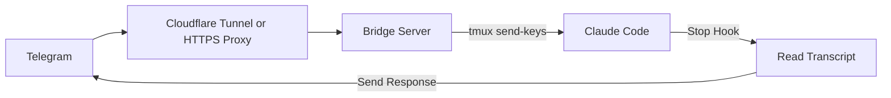

# claudecode-telegram

Telegram bot bridge for Claude Code. Send messages from Telegram, get responses back.


## Table of Contents

- [Background](#background)
- [Install](#install)
- [Usage](#usage)
- [Configuration](#configuration)
- [Docker Deployment (Caddy + HTTPS)](#docker-deployment-caddy--https)
- [Webhook Management (CLI)](#webhook-management-cli)
- [Testing](#testing)
- [Operational Verification](#operational-verification)
- [Security](#security)
- [Contributing](#contributing)
- [License](#license)

## Background

The bridge receives Telegram webhooks, injects messages into Claude Code via tmux, and sends Claude's responses back to Telegram via a Stop hook. It only responds to Telegram-initiated messages (using a pending file as a flag).



## Install

### Prerequisites (local/dev)

- Python 3.10+
- tmux
- cloudflared (if exposing locally without Docker)

### Setup

```bash
# Clone
git clone https://github.com/hanxiao/claudecode-telegram
cd claudecode-telegram

# Python env
uv venv && source .venv/bin/activate
uv pip install -e .
```

## Usage

### 1) Create a Telegram bot

- Message @BotFather, create a bot, and copy the bot token.

### 2) Configure the Claude Stop hook

```bash
cp hooks/send-to-telegram.sh ~/.claude/hooks/
nano ~/.claude/hooks/send-to-telegram.sh  # set your bot token
chmod +x ~/.claude/hooks/send-to-telegram.sh
```

Add to `~/.claude/settings.json`:

```json
{
  "hooks": {
    "Stop": [
      {
        "hooks": [
          {
            "type": "command",
            "command": "~/.claude/hooks/send-to-telegram.sh"
          }
        ]
      }
    ]
  }
}
```

### 3) Start tmux + Claude Code

```bash
tmux new -s claude
claude --dangerously-skip-permissions
```

### 4) Run the bridge

```bash
export TELEGRAM_BOT_TOKEN="your_token"
claudecode-telegram
# Note the webhook path shown in output (e.g., /<64-char-random-string>)
```

### 5) Expose the bridge (local dev)

```bash
cloudflared tunnel --url http://localhost:8080
```

### 6) Set the webhook

Recommended CLI commands:

```bash
# Set webhook with default domain (WEBHOOK_DOMAIN or coder.luandro.com)
claudecode-telegram set-webhook

# Set webhook with custom domain
claudecode-telegram set-webhook --domain your-domain.com

# Verify webhook is configured
claudecode-telegram verify-webhook

# Fetch current webhook info
claudecode-telegram get-webhook-info

# Delete webhook when needed
claudecode-telegram delete-webhook
```

Manual alternative:

```bash
# Replace <WEBHOOK_PATH> and <SECRET_TOKEN>
curl "https://api.telegram.org/bot${TELEGRAM_BOT_TOKEN}/setWebhook?url=https://YOUR-URL/<WEBHOOK_PATH>&secret_token=<SECRET_TOKEN>"
```

## Configuration

Environment variables can be set via `.env` (see `.env.example`).

| Variable                    | Default             | Description                                                                    |
| --------------------------- | ------------------- | ------------------------------------------------------------------------------ |
| `TELEGRAM_BOT_TOKEN`        | required            | Bot token from @BotFather                                                      |
| `TELEGRAM_WEBHOOK_SECRET`   | empty               | Secret token to validate webhook requests (recommended)                        |
| `WEBHOOK_DOMAIN`            | `coder.luandro.com` | Default domain for the `set-webhook` command                                   |
| `WEBHOOK_PATH`              | auto-generated      | Random webhook path (64-char hex string)                                       |
| `DM_ALLOWED_USER_ID`        | empty               | Single user ID allowed for DMs (private messages)                              |
| `ALLOWED_TELEGRAM_USER_IDS` | empty               | Comma-separated list of allowed user IDs for groups/channels                   |
| `TMUX_SESSION`              | `claude`            | tmux session name                                                              |
| `PORT`                      | `8080`              | Bridge port                                                                    |
| `HOST`                      | `127.0.0.1`         | Bridge host (set to `0.0.0.0` for Docker so Caddy can reach the bridge)         |
| `TELEGRAM_REACTION_EMOJI`   | thumbs up           | Emoji reaction (set to "none", "false", "0", or empty to disable)            |
| `TMUX_SOCKET`               | `/tmp/tmux-1000/default` | tmux socket path for Docker deployments                                 |
| `CADDY_HTTP_PORT`           | `8081`              | External HTTP port for Caddy (rootless-safe)                                   |
| `CADDY_HTTPS_PORT`          | `8443`              | External HTTPS port for Caddy (rootless-safe)                                  |

### Access Control

- **DM (private messages)**: `DM_ALLOWED_USER_ID` must be set to allow DMs. If empty, DMs are rejected.
- **Groups/channels**: `ALLOWED_TELEGRAM_USER_IDS` restricts who can use the bot in non-DM chats. If empty, all users are allowed (not recommended for production).

## Docker Deployment (Caddy + HTTPS)

This repo includes a Docker Compose stack with a Caddy reverse proxy for HTTPS.

### Prerequisites

```bash
# Ubuntu/Debian example
curl -fsSL https://get.docker.com -o get-docker.sh
sudo sh get-docker.sh
sudo usermod -aG docker $USER
sudo apt-get install docker-compose-plugin
```

### Configuration

1) Configure environment:

```bash
cp .env.example .env
nano .env
```

Set `HOST=0.0.0.0` in `.env` so the bridge binds to all interfaces inside the container.

2) Update your Caddyfile domain:

```caddyfile
your-domain.com {
    reverse_proxy bridge:8080
    # ... rest of configuration
}
```

3) Verify tmux socket path if needed:

```bash
tmux display-message -p "#{socket_path}"
# Set TMUX_SOCKET in .env if different
```

### Start services

```bash
docker compose up -d

docker compose logs -f
```

### Set the webhook

```bash
# Recommended CLI command
docker compose exec bridge claudecode-telegram set-webhook --domain your-domain.com

# Or manually
docker compose exec bridge curl "https://api.telegram.org/bot${TELEGRAM_BOT_TOKEN}/setWebhook?url=https://your-domain.com/${WEBHOOK_PATH}&secret_token=${TELEGRAM_WEBHOOK_SECRET}"
```

## Webhook Management (CLI)

The `claudecode-telegram` entrypoint supports webhook management:

- `set-webhook [--domain <domain>]`
- `get-webhook-info`
- `verify-webhook`
- `delete-webhook`

If no command is provided, the bridge server starts.

## Testing

### Install test dependencies

```bash
uv pip install -e ".[test]"
```

### Run tests

```bash
# Run all tests
pytest

# Only HTTPS connectivity tests
pytest tests/test_https_connectivity.py

# Deployment verification (network-dependent)
RUN_DEPLOYMENT_CHECKS=1 pytest tests/test_https_connectivity.py -m integration

# Custom domain
DEPLOYMENT_DOMAIN=your-domain.com RUN_DEPLOYMENT_CHECKS=1 pytest tests/test_https_connectivity.py -m integration
```

Some tests require Docker or a running stack (see `tests/` for details).

## Operational Verification

Operational checks and deployment readiness are documented here:

- `OPERATIONAL_VERIFICATION.md` (step-by-step checklist)
- `deploy-verify.sh` (server-side verification script)
- `VERIFICATION_SUMMARY.md` (status snapshot)

## Security

- Use `TELEGRAM_WEBHOOK_SECRET` to validate Telegram webhook requests.
- Restrict access with `DM_ALLOWED_USER_ID` and `ALLOWED_TELEGRAM_USER_IDS`.
- Never commit tokens. The repo includes a pre-commit hook to prevent this:

```bash
make install-hooks
# or
cp githooks/pre-commit .git/hooks/pre-commit
chmod +x .git/hooks/pre-commit
```

## Contributing

Issues and pull requests are welcome. Please keep changes scoped and document any new environment variables or operational steps.

## License

No license file is included yet. Assume all rights reserved until a LICENSE file is added.
