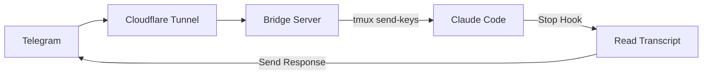

# claudecode-telegram


Telegram bot bridge for Claude Code. Send messages from Telegram, get responses back.

## How it works



1. Bridge receives Telegram webhooks, injects messages into Claude Code via tmux
2. Claude Code's Stop hook reads the transcript and sends response back to Telegram
3. Only responds to Telegram-initiated messages (uses pending file as flag)

## Install

```bash
# Prerequisites
brew install tmux cloudflared

# Clone
git clone https://github.com/hanxiao/claudecode-telegram
cd claudecode-telegram

# Setup Python env
uv venv && source .venv/bin/activate
uv pip install -e .
```

## Setup

### 1. Create Telegram bot

Bot receives your messages and sends Claude's responses back.

```bash
# Message @BotFather on Telegram, create bot, get token
```

### 2. Configure Stop hook

Hook triggers when Claude finishes responding, reads transcript, sends to Telegram.

```bash
cp hooks/send-to-telegram.sh ~/.claude/hooks/
nano ~/.claude/hooks/send-to-telegram.sh  # set your bot token
chmod +x ~/.claude/hooks/send-to-telegram.sh
```

Add to `~/.claude/settings.json`:

```json
{
  "hooks": {
    "Stop": [
      {
        "hooks": [
          {
            "type": "command",
            "command": "~/.claude/hooks/send-to-telegram.sh"
          }
        ]
      }
    ]
  }
}
```

### 3. Start tmux + Claude

tmux keeps Claude Code running persistently; bridge injects messages via `send-keys`.

```bash
tmux new -s claude
claude --dangerously-skip-permissions
```

### 4. Run bridge

Bridge receives Telegram webhooks and injects messages into Claude Code.

```bash
export TELEGRAM_BOT_TOKEN="your_token"
python bridge.py
# Note the webhook path shown in output (e.g., /<64-char-random-string>)
```

### 5. Expose via Cloudflare Tunnel

Tunnel exposes local bridge to the internet so Telegram can reach it.

```bash
cloudflared tunnel --url http://localhost:8080
```

### 6. (Optional but Recommended) Set webhook secret token

Generate a secure secret token to validate requests are from Telegram:

```bash
# Generate a secure random token
python3 -c "import secrets; print(secrets.token_urlsafe(32))"
```

Set the `TELEGRAM_WEBHOOK_SECRET` environment variable with the generated token:

```bash
export TELEGRAM_WEBHOOK_SECRET="<generated_token>"
```

### 7. Set webhook

Tells Telegram where to send message updates. Include the webhook path shown when starting the bridge. If you set a secret token, include it in the webhook URL.

```bash
# Replace <WEBHOOK_PATH> with the path shown in bridge output (e.g., /abc123...)
# Replace <SECRET_TOKEN> with your TELEGRAM_WEBHOOK_SECRET if configured
curl "https://api.telegram.org/bot${TELEGRAM_BOT_TOKEN}/setWebhook?url=https://YOUR-TUNNEL-URL.trycloudflare.com/<WEBHOOK_PATH>&secret_token=<SECRET_TOKEN>"
```

## Bot Commands

| Command          | Description                              |
| ---------------- | ---------------------------------------- |
| `/status`        | Check tmux session                       |
| `/clear`         | Clear conversation                       |
| `/resume`        | Pick session to resume (inline keyboard) |
| `/continue_`     | Auto-continue most recent                |
| `/loop <prompt>` | Start Ralph Loop (5 iterations)          |
| `/stop`          | Interrupt Claude                         |

## Environment Variables

| Variable                   | Default        | Description                                                                      |
| -------------------------- | -------------- | -------------------------------------------------------------------------------- |
| `TELEGRAM_BOT_TOKEN`       | required       | Bot token from BotFather                                                         |
| `TELEGRAM_WEBHOOK_SECRET`  | empty          | Secret token to validate webhook requests from Telegram (strongly recommended)   |
| `TMUX_SESSION`             | `claude`       | tmux session name                                                                |
| `PORT`                     | `8080`         | Bridge port                                                                      |
| `HOST`                     | `127.0.0.1`    | Bridge host (defaults to localhost-only for security)                            |
| `WEBHOOK_PATH`             | auto-generated | Random webhook path (64-char hex string) for security                            |
| `TELEGRAM_REACTION_EMOJI`  | ``             | Emoji to react to messages (set to "none", "false", "0", or empty to disable)    |

### Quick Setup with .env

```bash
# Copy the example environment file
cp .env.example .env

# Edit with your values
nano .env  # Add your TELEGRAM_BOT_TOKEN and optionally TELEGRAM_WEBHOOK_SECRET

# Source the file before running the bridge
source .env
python bridge.py
```
