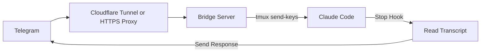

# claudecode-telegram

Telegram bot bridge for Claude Code. Send messages from Telegram, get responses back.


## Table of Contents

- [Background](#background)
- [Quick Start (Tunnel Mode)](#quick-start-tunnel-mode)
- [Install](#install)
- [Usage](#usage)
- [Configuration](#configuration)
- [Docker Deployment (Caddy + HTTPS)](#docker-deployment-caddy--https)
- [Webhook Management (CLI)](#webhook-management-cli)
- [Testing](#testing)
- [Deployment Verification](#deployment-verification)
- [Security](#security)
- [Contributing](#contributing)
- [License](#license)

## Background

The bridge receives Telegram webhooks, injects messages into Claude Code via tmux, and sends Claude's responses back to Telegram via a Stop hook. It only responds to Telegram-initiated messages (using a pending file as a flag).


```mermaid
flowchart LR
    A[Telegram] --> B[Cloudflare Tunnel or HTTPS Proxy]
    B --> C[Bridge Server]
    C -->|tmux send-keys| D[Claude Code]
    D -->|Stop Hook| E[Read Transcript]
    E -->|Send Response| A
```

## Quick Start (Tunnel Mode)

The fastest way to get started is using tunnel mode with Docker Compose. No public IP or domain required.

### Prerequisites

- Docker and Docker Compose (V1 or V2)
- A Telegram bot token from [@BotFather](https://t.me/BotFather)
- Your Telegram user ID from [@userinfobot](https://t.me/userinfobot)

### Setup

```bash
# 1. Clone the repo
git clone https://github.com/hanxiao/claudecode-telegram
cd claudecode-telegram

# 2. Configure environment
cp .env.example .env
nano .env  # Edit these values:
```

Required `.env` settings for tunnel mode:

```bash
TELEGRAM_BOT_TOKEN="your_bot_token_here"     # From @BotFather
DM_ALLOWED_USER_ID="123456789"                # Your Telegram user ID
DEPLOYMENT_MODE=tunnel                        # Use Cloudflare Tunnel
```

Optional settings (defaults work fine):

```bash
TMUX_SESSION=claude                           # tmux session name
WEBHOOK_AUTO_SETUP=true                       # Auto-configure webhook
TELEGRAM_REACTION_EMOJI=                      # Leave empty for thumbs up
```

### Start

```bash
# Start with Cloudflare Tunnel (one command)
./start-tunnel.sh
```

That's it! The script will:

- Create/start the tmux session
- Build and start Docker containers
- Automatically detect the tunnel URL and configure the Telegram webhook

### Verify

```bash
# Check container status
docker compose ps

# View webhook info
docker compose exec bridge python bridge.py get-webhook-info

# Monitor logs
docker compose logs -f bridge cloudflared
```

### Stop

```bash
docker compose --profile tunnel down
```

### Important Notes

1. **Tunnel URLs change each restart**: Cloudflare quick tunnels generate a new random URL each time they start. The bridge automatically detects and updates the webhook when this happens.

2. **tmux session required**: The bridge injects messages into Claude Code via tmux. Make sure Claude Code is running in the tmux session:

   ```bash
   tmux attach -t claude  # Attach to session
   claude --dangerously-skip-permissions
   # Press Ctrl+B then D to detach
   ```

3. **Port conflicts**: If port 8080 is in use, change `PORT` in `.env`.

## Install

### Prerequisites (local/dev)

- Python 3.10+
- tmux
- cloudflared (if exposing locally without Docker)

### Setup

```bash
# Clone
git clone https://github.com/hanxiao/claudecode-telegram
cd claudecode-telegram

# Python env
uv venv && source .venv/bin/activate
uv pip install -e .
```

## Usage

### 1) Create a Telegram bot

- Message @BotFather, create a bot, and copy the bot token.

### 2) Configure the Claude Stop hook

```bash
cp hooks/send-to-telegram.sh ~/.claude/hooks/
nano ~/.claude/hooks/send-to-telegram.sh  # set your bot token
chmod +x ~/.claude/hooks/send-to-telegram.sh
```

Add to `~/.claude/settings.json`:

```json
{
  "hooks": {
    "Stop": [
      {
        "hooks": [
          {
            "type": "command",
            "command": "~/.claude/hooks/send-to-telegram.sh"
          }
        ]
      }
    ]
  }
}
```

### 3) Start tmux + Claude Code

```bash
tmux new -s claude
claude --dangerously-skip-permissions
```

### 4) Run the bridge

```bash
export TELEGRAM_BOT_TOKEN="your_token"
claudecode-telegram
# Note the webhook path shown in output (e.g., /<64-char-random-string>)
```

### 5) Expose the bridge (local dev)

```bash
cloudflared tunnel --url http://localhost:8080
```

### 6) Set the webhook

Recommended CLI commands:

```bash
# Set webhook with default domain (WEBHOOK_DOMAIN or coder.luandro.com)
claudecode-telegram set-webhook

# Set webhook with custom domain
claudecode-telegram set-webhook --domain your-domain.com

# Verify webhook is configured
claudecode-telegram verify-webhook

# Fetch current webhook info
claudecode-telegram get-webhook-info

# Delete webhook when needed
claudecode-telegram delete-webhook
```

Manual alternative:

```bash
# Replace <WEBHOOK_PATH> and <SECRET_TOKEN>
curl "https://api.telegram.org/bot${TELEGRAM_BOT_TOKEN}/setWebhook?url=https://YOUR-URL/<WEBHOOK_PATH>&secret_token=<SECRET_TOKEN>"
```

## Configuration

Environment variables can be set via `.env` (see `.env.example`).

| Variable                    | Default                     | Description                                                             |
| --------------------------- | --------------------------- | ----------------------------------------------------------------------- |
| `TELEGRAM_BOT_TOKEN`        | **required**                | Bot token from @BotFather                                               |
| `DEPLOYMENT_MODE`           | **required**                | Deployment mode: `tunnel` (Cloudflare) or `production` (Caddy/HTTPS)    |
| `WEBHOOK_DOMAIN`            | **required for production** | Domain for webhook URL (only used when `DEPLOYMENT_MODE=production`)    |
| `TELEGRAM_WEBHOOK_SECRET`   | empty                       | Secret token to validate webhook requests (recommended)                 |
| `WEBHOOK_PATH`              | auto-generated              | Random webhook path (64-char hex string)                                |
| `WEBHOOK_AUTO_SETUP`        | `true`                      | Enable/disable automatic webhook configuration on startup               |
| `WEBHOOK_STARTUP_DELAY`     | `5`                         | Seconds to wait for dependent services before auto-setup                |
| `DM_ALLOWED_USER_ID`        | empty                       | Single user ID allowed for DMs (private messages)                       |
| `ALLOWED_TELEGRAM_USER_IDS` | empty                       | Comma-separated list of allowed user IDs for groups/channels            |
| `TMUX_SESSION`              | `claude`                    | tmux session name                                                       |
| `PORT`                      | `8080`                      | Bridge port                                                             |
| `HOST`                      | `127.0.0.1`                 | Bridge host (set to `0.0.0.0` for Docker so Caddy can reach the bridge) |
| `TELEGRAM_REACTION_EMOJI`   | thumbs up                   | Emoji reaction (set to "none", "false", "0", or empty to disable)       |
| `TMUX_SOCKET`               | `/tmp/tmux-1000/default`    | tmux socket path for Docker deployments                                 |
| `CADDY_HTTP_PORT`           | `8081`                      | External HTTP port for Caddy (rootless-safe)                            |
| `CADDY_HTTPS_PORT`          | `8443`                      | External HTTPS port for Caddy (rootless-safe)                           |

### Access Control

- **DM (private messages)**: `DM_ALLOWED_USER_ID` must be set to allow DMs. If empty, DMs are rejected.
- **Groups/channels**: `ALLOWED_TELEGRAM_USER_IDS` restricts who can use the bot in non-DM chats. If empty, all users are allowed (not recommended for production).

### Automatic Webhook Configuration

The bridge automatically configures the Telegram webhook on startup:

- **Tunnel Mode** (`DEPLOYMENT_MODE=tunnel`): Automatically detects the cloudflared tunnel URL and registers it with Telegram
- **Production Mode** (`DEPLOYMENT_MODE=production`): Uses the `WEBHOOK_DOMAIN` environment variable to register the webhook
- **Telegram Validation**: Verifies against actual Telegram webhook status (not just local state) to detect external changes
- **Retry Logic**: Waits up to ~60 seconds for the tunnel URL (tunnel mode) before requiring manual configuration

**Configuration:**

- Set `WEBHOOK_AUTO_SETUP=false` to disable automatic webhook configuration
- Adjust `WEBHOOK_STARTUP_DELAY` (default: 5 seconds) to allow more time for dependent services to initialize

**Verification:**

```bash
# Both "docker compose" (V2) and "docker-compose" (V1) commands are supported
# Check webhook status
docker compose exec bridge python bridge.py get-webhook-info
# OR: docker-compose exec bridge python bridge.py get-webhook-info

# Verify webhook is working
docker compose exec bridge python bridge.py verify-webhook

# Check health endpoint (includes webhook status and validates against Telegram)
docker compose exec bridge curl -s http://localhost:8080/health
```

### Troubleshooting

**"ERROR: DEPLOYMENT_MODE not set"**

You must explicitly set `DEPLOYMENT_MODE` in your `.env` file:

```bash
DEPLOYMENT_MODE=tunnel      # For local development with Cloudflare Tunnel
# or
DEPLOYMENT_MODE=production  # For public deployment with Caddy
```

**"ERROR: WEBHOOK_DOMAIN not set for production mode"**

When using `DEPLOYMENT_MODE=production`, you must also set `WEBHOOK_DOMAIN`:

```bash
WEBHOOK_DOMAIN=your-domain.com
```

**"State file exists but webhook not in Telegram"**

This warning appears when the local state file indicates a webhook was configured, but Telegram reports no webhook. The bridge will automatically reconfigure the webhook.

**Checking webhook status via health endpoint**

The `/health` endpoint always returns HTTP 200 but includes detailed status in the response body. Check `webhook_configured` field for webhook status:

```bash
curl -s http://localhost:8080/health | jq
# Look for: "webhook_configured": true/false
```

## Docker Deployment (Caddy + HTTPS)

This repo includes a Docker Compose stack with two deployment modes:

| Mode           | Description                    | Use Case                               |
| -------------- | ------------------------------ | -------------------------------------- |
| **Tunnel**     | Cloudflare quick tunnel        | Local development, no public IP needed |
| **Production** | Caddy reverse proxy with HTTPS | Public deployment with your own domain |

**Note:** All scripts and commands support both `docker compose` (V2, built into Docker Desktop) and `docker-compose` (V1, standalone plugin). The scripts automatically detect which version is available.

### Tunnel Mode (Recommended for Local Development)

See [Quick Start (Tunnel Mode)](#quick-start-tunnel-mode) for full instructions.

```bash
./start-tunnel.sh
```

### Production Mode

For production deployments with your own domain and Caddy HTTPS:

#### Prerequisites

```bash
# Ubuntu/Debian example
curl -fsSL https://get.docker.com -o get-docker.sh
sudo sh get-docker.sh
sudo usermod -aG docker $USER

# For Docker Compose V2 (included with Docker Desktop)
# No additional installation needed

# For Docker Compose V1 (standalone)
sudo apt-get install docker-compose-plugin
```

### Configuration

1. Configure environment:

```bash
cp .env.example .env
nano .env
```

Required `.env` settings for production mode:

```bash
TELEGRAM_BOT_TOKEN="your_bot_token_here"     # From @BotFather
DM_ALLOWED_USER_ID="123456789"                # Your Telegram user ID
DEPLOYMENT_MODE=production                    # Use Caddy HTTPS
WEBHOOK_DOMAIN=your-domain.com                # Your domain
```

2. Update your Caddyfile domain (if needed):

```caddyfile
your-domain.com {
    reverse_proxy bridge:8080
    # ... rest of configuration
}
```

### Start services

```bash
./start-production.sh
```

The webhook will be automatically configured on startup. Check the logs to verify:

```bash
docker compose logs bridge | grep -i webhook
```

### Webhook Management (Optional)

The webhook is configured automatically, but you can still manage it manually if needed:

```bash
# Verify webhook status
docker compose exec bridge python bridge.py verify-webhook

# Get webhook info
docker compose exec bridge python bridge.py get-webhook-info

# Manually set webhook (if auto-setup is disabled)
docker compose exec bridge python bridge.py set-webhook --domain your-domain.com

# Delete webhook
docker compose exec bridge python bridge.py delete-webhook
```

## Webhook Management (CLI)

The `claudecode-telegram` entrypoint supports webhook management:

- `set-webhook [--domain <domain>]`
- `get-webhook-info`
- `verify-webhook`
- `delete-webhook`

If no command is provided, the bridge server starts.

## Deployment Verification

Production deployment verification guide:

- **[docs/DEPLOYMENT_VERIFICATION.md](docs/DEPLOYMENT_VERIFICATION.md)** - Quick verification checklist, troubleshooting, and deployment modes reference

## Security

- Use `TELEGRAM_WEBHOOK_SECRET` to validate Telegram webhook requests.
- Restrict access with `DM_ALLOWED_USER_ID` and `ALLOWED_TELEGRAM_USER_IDS`.
- Never commit tokens. The repo includes a pre-commit hook to prevent this:

```bash
make install-hooks
# or
cp githooks/pre-commit .git/hooks/pre-commit
chmod +x .git/hooks/pre-commit
```

## Contributing

Issues and pull requests are welcome. Please keep changes scoped and document any new environment variables or operational steps.

## License

No license file is included yet. Assume all rights reserved until a LICENSE file is added.
